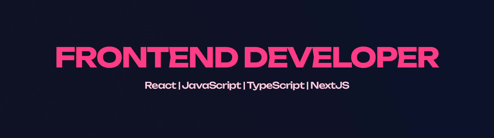

## 🚀 About Me

* 💻 Frontend-focused **Software Engineering** student (3rd year).
* 🎯 Specializing in building scalable, maintainable **React applications** with modern architecture.
* 🧠 Focus on **frontend architecture, performance optimization, and state management**.
* ⚙️ Backend experience (Node.js / NestJS) to support full-cycle development.

---

## 🛠️ Core Skills

### 🎨 Frontend (Primary Focus)

* **Frameworks & Core:** React, TypeScript, JavaScript (ES6+), NextJS (SSR)
* **Architecture:** Feature-Sliced Design (FSD), modular SCSS, scalable project structure
* **State Management:** Zustand, Redux Toolkit, MobX
* **Data Fetching:** TanStack Query, Axios
* **Styling:** SCSS, Tailwind, responsive & adaptive design
* **Testing:** Jest, React Testing Library, Playwright
* **Performance:** memoization, lazy loading, code splitting, rendering optimization
* **UI:** AntD, Mantine UI, Shadcn, Headless UI.
* **Animations & canvas:** PixiJS, Framer Motion, Anime.js

---

### ⚙️ Backend (Supporting)

* NestJS, Node.js, Express
* TypeORM, PostgreSQL
* REST API design

---

### 💻 Programming

* TypeScript, JavaScript (primary)
* C++, Java, C#

---

### 🧰 Tools & Environment

* Git, Docker
* Vite, Webpack (Basic)
* Linux, Proxmox, VirtualBox
* CI/CD

---

## 🌐 Contact

* 💼 LinkedIn: https://linkedin.com/in/nikita-shipilov
* 📱 Telegram: https://t.me/undefined_null_0
* 📧 Email: [nsshipilov@gmail.com](mailto:nsshipilov@gmail.com)
* 📚 Projects: [My GitHub](https://github.com/LAYT73)

