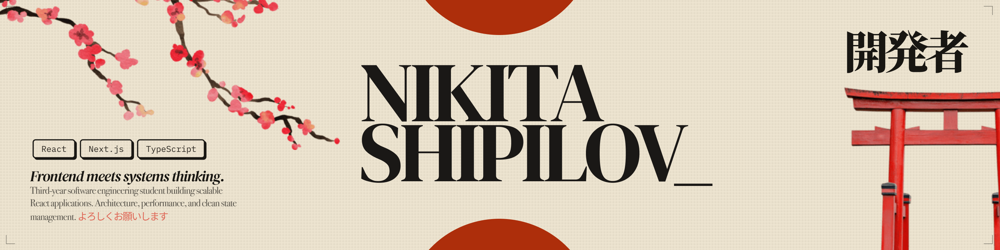
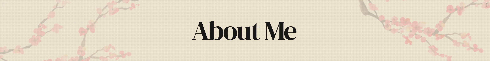
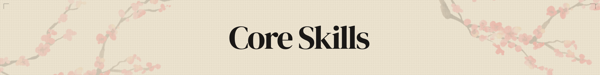
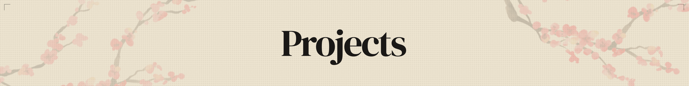
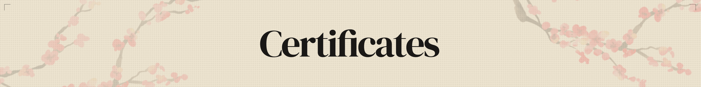

  <!-- Frontend -->
  
  
  
  
  
  <!-- Styling -->
  
  
  
  <!-- State -->
  
  
  
  
  <!-- Data -->
  
  
  
  
  <!-- UI -->
  
  
  
  
  <!-- Animation -->
  
  
  
  <!-- Testing -->
  
  
  
  
  
  <!-- Build -->
  
  
  
  <!-- DevOps -->
  
  

## 

* Frontend-focused **Software Engineer**.
* Specializing in building scalable, maintainable **React applications** with modern architecture.
* Focus on **frontend architecture, performance optimization, and state management**.
* Backend experience (`Node.js` / `NestJS`) to support full-cycle development.

---

## 

| Category | Skills |
|---|---|
| Frontend (Primary Focus) | React, TypeScript, JavaScript (ES6+), NextJS (SSR) |
| Architecture | Feature-Sliced Design (FSD), modular SCSS, scalable project structure |
| State Management | Zustand, Redux Toolkit, MobX |
| Data Fetching | TanStack Query, Axios |
| Styling | SCSS, Tailwind, responsive & adaptive design |
| Testing | Jest, React Testing Library, Playwright |
| Performance | memoization, lazy loading, code splitting, rendering optimization |
| UI Libraries | AntD, Mantine UI, Shadcn, Headless UI |
| Animations & Canvas | PixiJS, Framer Motion, Anime.js |
| Backend (Supporting) | NestJS, Node.js, Express |
| Database & ORM | TypeORM, PostgreSQL |
| API | REST API design |
| Tools & Environment | Git, Docker, Vite, Webpack (Basic), Linux, Proxmox, VirtualBox, CI/CD |

---

## 

<strong>1) zero-guess-frontend</strong> — Enterprise-grade React CLI scaffolding tool

 
CLI for rapid initialization of production-ready React applications with zero manual configuration. Eliminates boilerplate and enforces architectural best practices from day one.

**Core capabilities:**
Create projects with multiple architecture patterns (Feature-Sliced Design, Atomic Design, or Empty), TypeScript or JavaScript, integrated Vite build system, and pre-configured git setup. Choose from npm, yarn, or pnpm. Includes optional routing with react-router-dom (public/private route templates) and state management integration (Redux Toolkit or MobX).

**Developer tools:**
Generate custom components using YAML templates and configuration files. Create and share reusable project presets via `zgf-preset`. Extensible template system for adding your own patterns. Automatic configuration of package.json, ESLint, tsconfig, and .gitignore.

**Modes:**
Interactive CLI prompts or direct command-line options for CI/CD automation.

**Links:**
- [Repository](https://github.com/LAYT73/zero-guess-frontend)
- [npm Package](https://www.npmjs.com/package/zero-guess-frontend)
- [Documentation](https://layt73.github.io/zero-guess-frontend-docs/)
- [GitHub Issues](https://github.com/LAYT73/zero-guess-frontend/issues)

<strong>2) SoccerStat</strong> — Frontend application for football statistics

 
SoccerStat is a frontend application for exploring football statistics, including leagues, teams, and match calendars. It was developed as a test assignment for a Simbirsoft internship, and it helped me pass the internship selection.

The project is built with React 19, TypeScript, Vite 8, and TanStack Query, with React Router 7 for navigation. It uses Ant Design 6 and Tailwind CSS 4 for the UI, Zod for schema validation, Axios for API communication, and Sentry for client-side error monitoring. The codebase also includes Vitest for testing and a Docker-based setup for local development and production deployment.

**Links:**
- [Repository](https://github.com/LAYT73/SoccerStat)

---

## 

- **EF SET English Certificate (B2)**  
  Date: April 2026  
  Accreditation ID: 52/100 (B2)  
  Verify: https://cert.efset.org/en/1TNBM6
  
<!-- 
---

-->
---

  <a href="https://nikita-shipilov.vercel.app">Landing Page</a> |
  <a href="https://linkedin.com/in/nikita-shipilov">LinkedIn</a> |
  <a href="https://t.me/undefined_null_0">Telegram</a> |
  <a href="mailto:nsshipilov@gmail.com">Gmail</a> |
  <a href="https://github.com/LAYT73">My GitHub</a>

